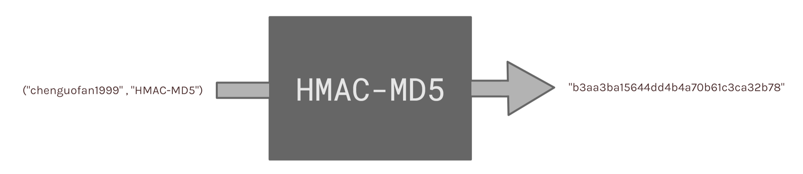

# HMAC-MD5

[](https://sourcegraph.com/github.com/chenguofan1999/HMAC-MD5)



## What is this?

A simple C implementation of HMAC-MD5 algorithm.


## Who could make use of this?

Students who are learning HMAC / MD5. 

## How to use it?

The source code is a single header file, you only need to include the [HMAC-MD5.h](src/HMAC-MD5.h) in your .c / .cpp file.

**Example**

```c
#include <stdio.h>
#include "HMAC-MD5.h"
int main()
{
    printf("%s\n", MD5("data"));
    printf("%s\n", HMAC_MD5("key", "data"));
}
```

**output**

```
8d777f385d3dfec8815d20f7496026dc
9d5c73ef85594d34ec4438b7c97e51d8
```
